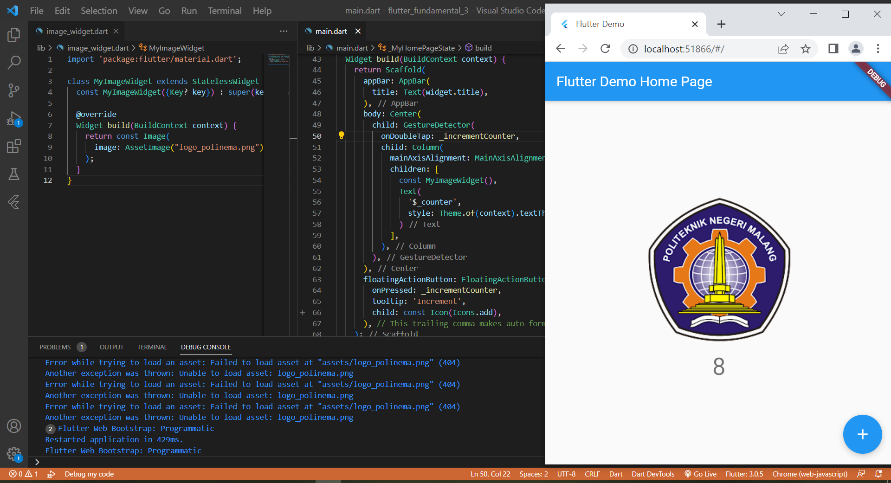
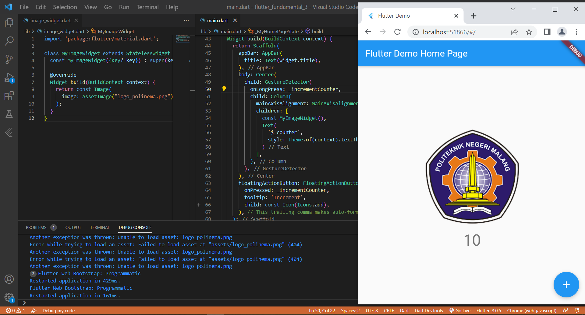
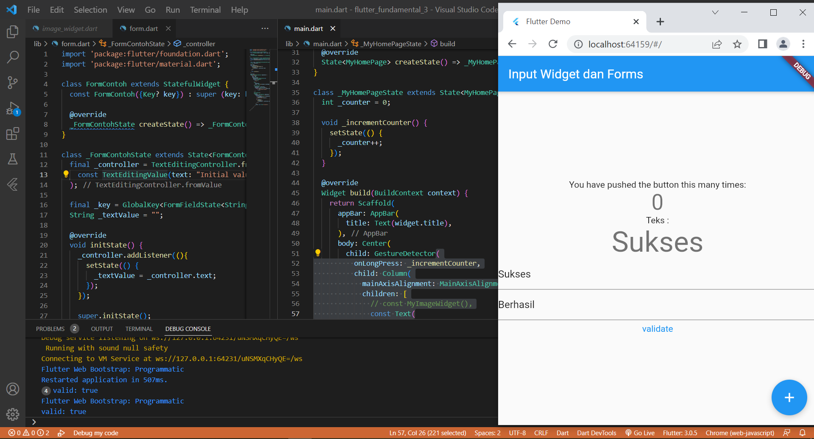
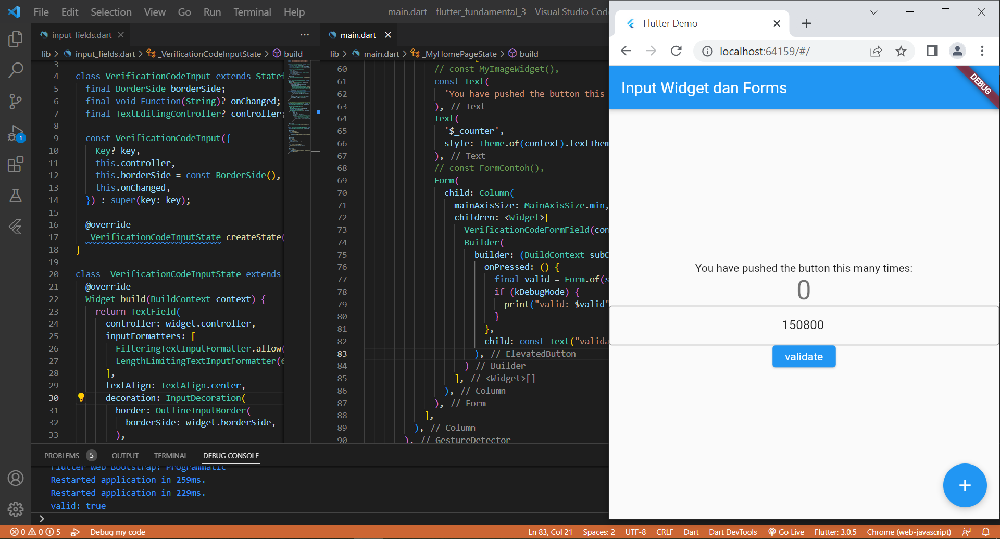

# flutter_fundamental_3

- menerapkan jenis-jenis gesture
- menerapkan input widget dan controllernya
- menerapkan custom input dan FormField widget

## Praktikum 1: Menerapkan Gesture Detector

###  1. onTap

Penjelasan Code : Pada kode program diatas terdapat child gestureDetector yang berisi nilai _incrementCounter yang artinya ketika gambar di-tap satu kali maka angka di bawah gambar akan terus bertambah.

### 2. onDoubleTap

Penjelasan Code : Hal ini masih sama dengan nomor 1 namun mengubah gestureDetector menjadi onDoubleTap, sehingga angka akan berubah ketika di-tap 2x.

### 3. onLongPress

Penjelasan Code : Hal ini masih sama dengan nomor 1 namun mengubah gestureDetector menjadi onLongPress, sehingga angka akan berubah ketika di-klik cukup panjang.

## Praktikum 2: Menerapkan Input Widget dan Forms

Penjelasan Code :

## Praktikum 3: Menerapkan Custom Input dan FormField Widget

Penjelasan Code :